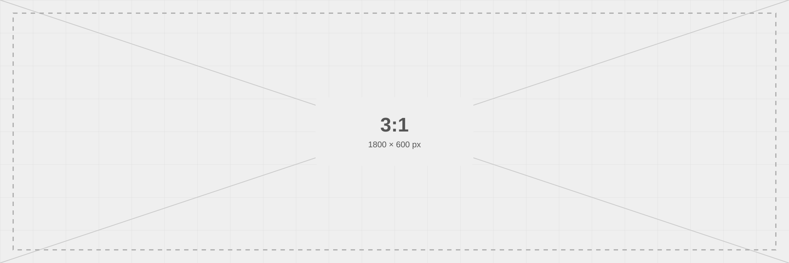

# aizome

Marp用のカスタムテーマです。Markdownで内容を書き、クラスでレイアウトを選びます。

## AI Agentに制作を依頼する場合

AI向けの入口は [AGENTS.md](AGENTS.md)、判断基準と制作手順は [AI向けスライド制作ガイド](docs/AI_SLIDE_GUIDE.md) にまとめています。レイアウト選択、内容量、余白、画像、出典・参照、表示確認を扱います。

依頼例：「AGENTS.mdとAI向け制作ガイドを読み、このテーマで○○向けの発表資料を作ってください。目的は○○、持ち時間は○分、元資料は○○です。」

## v3のAI支援・配布ツール

- [機械向けレイアウト定義](ai/layouts.json)：必要な構造、項目数、併用条件、旧クラスの移行先。
- [確認・配布ツール](tools/README.md)：静的チェック、ブラウザでの表示確認、HTMLと画像・フォントのZIP化。
- [改善例](examples/repairs.md)：修正前後のMarkdownと、修正を選んだ理由。

```bash
python3 tools/check_slides.py template.md --json
python3 tools/package_slides.py presentation.html dist/presentation.zip
```

静的チェックとZIP作成はPython標準機能だけで動きます。編集・プレビューにPythonやNode.jsを必須にするものではありません。公開リリースのHTML配布ZIPには画像・フォント・フォントライセンスが入り、全展開して `index.html` を開けます。絵文字などの外部依存は同梱の `manifest.json` に記録されます。

## 改善PRを歓迎します

制作中に見つかった表示の不具合や、ほかの資料にも役立つカスタマイズをぜひ還元してください。[貢献ガイド](CONTRIBUTING.md)に、AI Agentからの案内、変更の切り分け、fork・PR作成の手順をまとめています。Agentには「今回の共通部分の改善を、作者へPRしてください」と依頼できます。

## 資料全体の配色テーマを選ぶ

Markdown冒頭の `theme:` を1か所変更すると、全スライドの表紙・見出し・背景の淡色・カード・表・章扉・蛍光ペンの配色をまとめて切り替えられます。レイアウトや本文の書き換えは不要です。

| 資料全体のテーマ | `theme:` の値 | 雰囲気 |
|---|---|---|
| 藍（標準） | `aizome` | 明瞭な青と白 |
| 青鈍 | `aizome-aonibi` | 落ち着いた青緑と灰白 |
| 紫 | `aizome-murasaki` | 紫を基調とした柔らかな配色 |
| 琥珀 | `aizome-kohaku` | 茶金と淡い暖色 |
| 墨 | `aizome-sumi` | 青みを帯びた墨色と灰白 |

```yaml
---
marp: true
theme: aizome-kohaku
paginate: true
---
```

各スライドの `_class: cards` や `_class: media media-right` はそのままで構いません。`palette-*` はそのスライドだけ強調色を変える指定なので、資料全体を揃える場合は省略します。`surface-dark` と `surface-tint` も選んだテーマに連動します。エラー・警告などの意味を持つ色とコードの構文色は、読み分けのため共通です。

このリポジトリのVS Code設定には5テーマを登録済みです。別の作業場所へコピーする場合は `aizome.css`・`themes/`・`assets/` を持ち込み、Marpのテーマ設定にベースCSSと4つのテーマCSSを登録してください。CLIではまとめて読み込みます。

```bash
marp presentation.md --theme-set aizome.css themes/*.css --output presentation.html
```

外部の画像・SVGにはテーマのCSSが継承されません。グラフや図版の色も揃える場合は、選んだテーマの配色を素材側に使ってください。AI向けの選択肢は [ai/themes.json](ai/themes.json)、色の原本は [ai/colors.json](ai/colors.json) です。通常の編集・表示にテーマ生成処理は不要です。

## カテゴリから選ぶ

[template.md](template.md) を**7カテゴリ・全47枚**に整理しました。作例は見た目・用途が異なるものに絞り、設定方法はこのREADMEに集約しています。各カテゴリの先頭に扉を置いています。2枚目が全体の目次です。

| カテゴリ | スライド |
|---|---|
| 導入・本文 | 3〜8枚目 |
| カード・比較・数値 | 9〜17枚目 |
| 時系列・画面遷移 | 18〜22枚目 |
| 画像・図版 | 23〜33枚目 |
| コード・数式 | 34〜37枚目 |
| 配色・余白・見出し | 38〜41枚目 |
| 結論・補足 | 42〜47枚目 |

必要な1枚を `---` の区切り線と `<!-- _class: ... -->` ごとコピーしてください。Front Matterはデッキ全体に1つだけ必要です。本文に `div`・`span`・`br`・インラインCSSを書く必要はありません。

同じレイアウトの左右反転・色・タイトルの有無・比率の近い画像は、設定を切り替えて使います。カードの1段／2段、時系列の4配置、正方形／横長／縦長／パノラマなど、形を見比べる意味がある例は残しています。出典は比較表、注釈は数値、図表リンクは参考資料の作例に組み込みました。

## 主な指定

### カードは項目数から自動配置

`cards` だけで、リスト項目数に合わせて並びます。`four`・`grid` は不要です。

| 項目数 | 配置 |
|---|---|
| 1 | 1列 |
| 2 | 2列 |
| 3 | 3列 |
| 4 | 2列 × 2行 |
| 5〜6 | 3列 × 2行 |

```markdown
<!-- _class: cards card-middle -->

# 3つの特徴

- **見つける**

  必要な情報にたどり着く。
- **理解する**

  要点と根拠を確認する。
- **動く**

  次の行動を選ぶ。
```

`card-top` は上揃え、`card-middle` は上下中央、`card-text-center` は文字も左右中央揃えです。推奨上限は6枚で、説明は1〜2行が目安です。4枚以上では最小高さを180pxにし、2行が収まるようにします。必要ならCSSの `--card-height` を調整できます。

2項目なら `cards` が自動で2列になります。2列の幅は `wide-left` / `wide-right`（無指定で均等）、強調位置は `focus-left` / `focus-center` / `focus-right` / `focus-both` を組み合わせます。`focus-center` は3項目の中央、`focus-left` / `focus-right` は先頭／末尾のカードです。`gallery` も2〜3枚、`screen-flow` も3〜4画面を項目数で判定します。

数値を並べる場合も `cards` を使います。`card-middle card-text-center` で中央にそろえ、数値を見出し、説明を段落にします。専用の `kpi` クラスは廃止しました。

```markdown
<!-- _class: cards card-middle card-text-center -->

# 利用状況

- ## 128

  利用チーム数
- ## 86%

  タスク完了率
- ## 2.4分

  平均作業時間
```

### 共通クラスに統一した指定

内容の用途ごとにクラスを覚える必要はありません。

| 以前の専用指定 | 現在の指定 |
|---|---|
| `columns` | `cards`（2項目で2列） |
| `compare` | `cards focus-right` |
| `recommend-first` / `recommend-middle` / `recommend-last` | `focus-left` / `focus-center` / `focus-right` |
| `definition` | `lead` |
| `qa` | `lead surface-tint` |
| `proof` | `align-middle`（標準の数式・引用） |
| `agenda` / `summary` | `list`（目次・要点共通） |

これらの旧クラスは削除しました。用語の定義や質疑応答も `lead` の見出し・本文を差し替えて作れます。`stat` は数字を112pxに拡大する専用配置、`matrix` は行と列で判断する表なので残しています。

### 目次・要点まとめとページリンク

目次も要点まとめも `list` を使い、番号付きリストに項目を書きます。番号を出さない場合は `-` の箇条書きにします。

```markdown
<!-- _class: list -->

# 目次

1. **導入** [3枚目](#3)
2. **比較** [9枚目](#9)
```

`[3枚目](#3)` で、書き出したHTMLの3枚目へ移動できます。目次ではリンクを右にそろえます。テンプレートのページ範囲は、そのカテゴリの先頭へリンクしています。ページ番号は手動なので、スライドを増減したら表示とリンク先の両方を更新してください。PDF・PowerPointでは同じ移動動作を保証しません。

入れ子の番号付きリストは、次のクラスで表記を選べます。Markdownには常に `1.`・`2.`・`3.` と書き、表示だけを切り替えます。

| クラス | 表示 |
|---|---|
| `nested-roman`（標準） | i. / ii. / iii. |
| `nested-alpha` | a. / b. / c. |
| `nested-kana` | ア. / イ. / ウ.（五十音順） |
| `nested-decimal` | 1. / 2. / 3. |

例えば `<!-- _class: media media-right diagram nested-alpha -->` と指定します。スライド内の入れ子の番号付きリストに適用され、最上位の番号や時系列の丸内の番号は変えません。番号欄は共通の固定幅で、本文と折り返し行の開始位置を揃えます。同時に選ぶ表記は1種類です。

要点まとめは同じクラスのまま、項目と説明を差し替えます。

```markdown
<!-- _class: list -->

# 要点のまとめ

1. **結論を先に示す**

   読み手が全体像をつかめるようにする。
2. **次の行動を明確にする**

   誰が、いつ、何をするかを残す。
```

### 時系列は方向・折り返し・番号を組み合わせる

旧 `timeline-wrap`・`timeline-horizontal` を整理し、`timeline` を共通のクラスにしました。テンプレート内の旧作例は削除しています。

| 指定 | 配置・読む順序 | 推奨上限 |
|---|---|---|
| `timeline` | 縦1列・上から下 | 6項目 |
| `timeline split` | 左上→左下→右上→右下 | 10項目 |
| `timeline horizontal` | 横1段・左から右 | 6項目 |
| `timeline horizontal split` | 上段の左→右、下段の左→右 | 10項目 |

`numbered` を追加すると丸の中に連番を表示し、外すと点だけになります。縦・横・折り返しのすべてで共通です。

```markdown
<!-- _class: timeline horizontal split numbered -->

# 公開までの流れ

1. **4月｜調査**

   課題を集める。
2. **5月｜設計**

   仮説を形にする。
3. **6月｜試作**

   操作を確かめる。
4. **7月｜公開**

   運用を始める。
```

項目数は自動で数えます。二列・二段では前半と後半に分け、奇数なら左列／上段が1件多くなります（例：7項目は4＋3）。縦の折り返しでは左の下端と右の上端、横二段では上段の右端と下段の左端まで線が抜けて、連続性を表します。文字は余白の内側に残ります。

**上限は短い見出し＋説明1〜2行を前提とした目安です。** 長文は上限未満でも分割してください。上限を超えた場合はスライド外へのはみ出しが起こりえます。自動分割や自動縮小は行いません。上限超過や文字の収まりはプレビューで確認してください。二列・二段は4〜10項目を想定しています。

### 小さなセクション名＋タイトル

```markdown
<!-- _class: section-title -->
<!-- _header: 03 / 時系列・画面遷移 -->

# 公開までの流れ

本文を書きます。
```

セクション名は15px、タイトルは通常と同じ34pxで、その下に表示します。`section-title` は `cards`・`timeline` などの本文レイアウトと併用できます。`_header` はその1枚だけに適用します。

`no-title` を追加するとセクション名とタイトルを隠し、見出し用の余白も取り除きます。ソース内の `# タイトル` は残しても省略しても構いません。`no-title` は画面遷移・カード・時系列でも共通です。

### スマホの画面遷移

`screen-flow` と番号付きリストで、画像 → 画面名 → 操作の順に書きます。3画面か4画面かは自動判定します。

```markdown
1. 

   **01. 一覧**

   商品を選ぶ。
```

各項目を同じ形で続けると矢印でつながります。パスを実際のスクリーンショットに差し替えてください。標準表示高は3画面400px、4画面352px、`no-title` 付き440pxで、元の縦横比を保ちます。CSSの `--screen-height`・`--screen-gap` で調整できます。上限は4画面です。

### プロフィール

名前・肩書き・紹介文と写真を上段、経歴など3項目を下段に配置します。本文列は最大792px、写真176px、間隔32pxです。写真の縁取りと影は付けていません。

- `profile`：右写真。`profile-left` を加えると左写真。
- `avatar-circle` / `avatar-square` / `avatar-rounded`：丸形・四角形・角丸。
- Markdownの順序：写真 → 名前（h2）→ 肩書き → 紹介文 → 3項目のリスト → ひとことの引用 → SNS。
- 写真は ``。中央基準で切り抜きます。

GitHub・X・LinkedIn・Websiteのアイコンとラベルを用意しています。例の人物と紹介文は架空、URLはサンプルなので差し替えて使ってください。

```markdown
[ X](https://x.com/) [ LinkedIn](https://www.linkedin.com/)
```

### 画像・図版

`media media-right` は右画像、`media-left` は左画像です。画像を1つ目、説明を2つ目のリスト項目に書きます。`media-both` は左画像 → 本文 → 右画像の3項目です。

| 比率 | クラス | プレースホルダー（assets/placeholders/） |
|---|---|---|
| 1:1 | `ratio-1x1` | `square.svg` |
| 16:9 | `ratio-16x9` | `landscape-16x9.svg` |
| 4:3 | `ratio-4x3` | `landscape-4x3.svg` |
| 3:4 | `ratio-3x4` | `portrait-3x4.svg` |
| 9:16 | `ratio-9x16` | `portrait-9x16.svg` |
| 3:1 | `figure ratio-3x1` | `panorama.svg` |

```markdown
<!-- _class: media media-right ratio-1x1 -->

# 商品の紹介

- 
- **説明の見出し**

  ここに本文を書きます。
```

`fit-contain` は全体表示（標準）、`fit-cover` は枠を埋めて切り抜きます。`media`・`image-grid` では画像ごとに `` で中央、`` で上端基準を指定できます。

左右に画像を置く `media-both` は引き続き使えます。縦横比が異なる画像は見た目の大きさが揃いにくいため、比較では比率を揃えるか、目的に合う `ratio-*` の作例を選んでください。

`media-frame` で余白付きの枠を追加できます。`diagram` は図の外周24px、本文との間48pxを確保し、高さ480pxの枠に収めます。SVGを再生成しても余白は維持されます。`media-wide` は画像側を3:2に広げます（両側画像とは併用しません）。

図だけを1枚で大きく見せる場合は `figure no-title` と `` を使います。標準のスライドでは上下60pxの余白を残し、図全体を中央に表示します。シーケンス図の作例はこの配置です。

楽譜も同じ `media media-right diagram` の画像を `assets/generated/score.svg` に差し替えて表示できます。楽譜・フロー図・シーケンス図に別々のレイアウト指定は必要ありません。

通常の画像は `` / `` で寸法を指定できます。`media`・`ratio-*`・`image-grid` 内ではCSSでサイズを管理するので寸法指定を重ねません。通常の画像例はスライドの余白内に収め、`full-image` だけは意図的に端まで使います。

### グラフを入れる

棒・折れ線・ドーナツのSVG作例を [assets/charts/](assets/charts/) に同梱しています。画像なので、表示に追加のNode.js・プラグイン・変換処理は不要です。Markdownの表や数値を自動的にグラフ化する機能ではありません。

```markdown
<!-- _class: figure captioned -->

# 項目Bの件数が最も多い


###### 図2：項目別件数（架空データ）
```

| 伝えたいこと | 同梱画像 | 使い方 |
|---|---|---|
| 項目間の大小 | `bar.svg` | 棒グラフ。原則として数値軸を0から始める |
| 時間による変化 | `line.svg` | 折れ線。時間間隔・単位を揃える |
| 全体に占める割合 | `donut.svg` | ドーナツ。少数の項目に絞り、合計100%にする |

配置は既存のものを使います。`figure` で図を大きく、`figure no-title` と `h:600` でタイトルなし、`media media-right diagram` で図と解説、`gallery` で複数の図を並べられます。軸や凡例が切れるため、グラフに `fit-cover`・`crop` は使いません。発表用は1枚に1グラフを基本とし、カタログの3種類一覧は選択のための見本です。

**数値を変える場合**は、普段使う表計算・作図ツールからSVGまたはPNGを書き出し、画像のパスを差し替えます。AI AgentにデータからSVGを作ってもらう場合は、[グラフ素材の説明](assets/charts/README.md)を参照します。同梱の `data.csv` は作例の元データで、CSVを書き換えてもSVGは自動更新されません。

色は `ai/colors.json` の藍を主系列に、琥珀・紫を補助系列に使います。同じ系列には資料全体で同じ色を使い、値・ラベル・線種も併用します。外部画像にスライドの `palette-*` は自動反映されないため、画像側でも配色を合わせてください。

### 余白・位置・色

| 目的 | クラス |
|---|---|
| 外側の余白 | `space-compact` / `space-standard` / `space-airy` |
| カラム間隔 | `gap-sm` / `gap-md` / `gap-lg`：16 / 24 / 48px |
| カード・画像枠の内側 | `inset-sm` / `inset-md` / `inset-lg`：16 / 24 / 32px |
| 段落間 | `flow-sm` / `flow-md` / `flow-lg`：16 / 24 / 32px |
| 本文を横に寄せる | `content-left` / `content-center` / `content-right` |
| 内容全体を縦に寄せる | `align-top` / `align-middle` / `align-bottom` |
| スライド端の色帯 | `rail-left` / `rail-right` / `rail-both` |

外側の標準は左右72px・本文上端124px・下60px。compactは56 / 112 / 44px、airyは96 / 140 / 76pxです。`section-title` は本文上端を148pxにして見出し領域を確保します。カード内の配置とスライド全体の配置は別々です。`content-*` は本文幅を64%に絞るため、写真や時系列の専用配置との併用は避けてください。

任意の場所に空間を追加するには、前後に空行を置いて次を挿入します。

```markdown
前の段落。


次の段落。
```

`vspace-xs` / `sm` / `md` / `lg` / `xl` / `2xl` で8 / 16 / 24 / 32 / 48 / 64pxを追加します。カード内ではインデントしてください。通常の段落間隔に加算されます。

配色は `palette-ai`・`palette-aonibi`・`palette-murasaki`・`palette-kohaku`・`palette-haizakura`・`palette-sumi` の6種類です。配色一覧の1枚で比較できます。`emphasis` は太字に強調色、`surface-tint` は淡い背景、`surface-dark` は濃い背景を適用します。引用には `note-success` / `note-warning` / `note-danger` も使えます。

### コード欄をエディタ風にする

`<!-- _class: code code-dark -->` で、コード欄だけを黒背景にできます。通常の明るい背景へ戻す場合は `code-dark` を外します。カード内でも `cards code-notes code-dark` として使えます。

黒背景の構文色は、背景用の淡色とは別の `darkAccent` を使います。予約語は紫、文字列は青鈍、関数名は藍、数値は琥珀、組み込み関数は灰桜です。明るい背景と暗い背景で読みやすい濃さを使い分け、定義は `ai/colors.json` に集約しています。

言語名はコード欄の左上に置き、区切り線と余白で本文から離します。コードフェンスに `python`・`javascript` などを書くと表示されます。言語指定のないブロックにはラベルを表示しません。スライド全体を濃色にする既存の `surface-dark` とも併用できます。

数式は `$ ... $` が文中、`$$ ... $$` が独立した表示です。複数行の導出は `aligned` の `&` で等号の位置を揃え、`\\` で改行します。数式の作例は1枚に統合しています。

### 蛍光ペン風の強調と配色名

`***重要な言葉***` で、文字の下側に蛍光ペンのような色を引けます。通常のMarkdownの「太字＋強調」を使うため、HTMLや追加の変換処理は不要です。`**太字**` は通常の太字、`*強調*` は通常の強調のままです。`==文字==` はこのテーマでは使いません。

```markdown
<!-- _class: lead palette-ai marker-kohaku -->

# 判断に必要な情報をそろえる

## まずは ***対象を絞って試す***

通常の文章の中でも、***重要な箇所だけ***に色を引けます。
```

標準の線色はスライドの配色と連動します。線の色だけ変える場合は `marker-*` を追加します。折り返しにも対応し、濃い背景では文字が読める濃さの線に切り替わります。短い語句に絞り、段落全体への多用は避けてください。

| 表示名 | 配色のクラス | 線色だけの指定 |
|---|---|---|
| 藍 | `palette-ai` | `marker-ai` |
| 青鈍 | `palette-aonibi` | `marker-aonibi` |
| 紫 | `palette-murasaki` | `marker-murasaki` |
| 琥珀 | `palette-kohaku` | `marker-kohaku` |
| 灰桜 | `palette-haizakura` | `marker-haizakura` |
| 墨 | `palette-sumi` | `marker-sumi` |

見出し・本文・リンク・表・カード・コード・注釈は共通の役割別変数を使います。色の原本は [ai/colors.json](ai/colors.json) に集約し、濃い背景や蛍光ペンの色も同じ定義から作っています。図版や写真そのものの色は画像素材側の指定です。

スライドごとに色を変えたい理由がなければ、同じ `palette-*` を通して使います。MarkdownのFront Matterの `class` はローカルな `_class` と単純に加算されるものではないため、各スライドの `_class` に同じ配色を明示する方法を推奨します。

旧名は廃止しました：`palette-blue` → `palette-ai`、`palette-teal` → `palette-aonibi`、`palette-violet` → `palette-murasaki`、`palette-amber` → `palette-kohaku`、`palette-rose` → `palette-haizakura`、`palette-slate` → `palette-sumi`。

同じ種類の指定は1つずつ選んでください。クラスを書く順番は優先順位に影響しません。独自の調整は `aizome.css` にクラスを追加してCSS変数を変更します。

```css
section.my-layout {
  --panel-gap: 32px;
  --panel-inset: 28px;
  --card-height: 200px;
}
```

### 絵文字コード

Marp標準の絵文字コードを、本文・見出し・箇条書きにそのまま書けます。HTMLや追加プラグインは不要です。

```markdown
# :rocket: 公開までの流れ

- :white_check_mark: 確認済み
- :warning: 公開前に確認
- :bulb: 改善のアイデア
```

40枚目に、よく使う18種類とコードを1枚にまとめています。コードそのものを表示するときはバッククォートで囲みます（例：`:smile:`）。未対応のコードはそのまま文字として残ります。絵文字はMarp標準のTwemoji配信元から画像を読み込むため、表示・書き出し時にインターネット接続が必要です。

### 長いタイトル

`title-long` を本文用レイアウトに追加すると、34pxの文字サイズを保ったまま、タイトル2行分の領域を確保します。小さなセクション名を出す `section-title` とも組み合わせられます。

```markdown
<!-- _class: title-long section-title cards -->
<!-- _header: 02 / 調査結果 -->

# 長いタイトルをここに書くと、幅に合わせて自然に折り返します
```

2行までが目安です。3行になる場合はタイトルを短くし、補足を本文へ移してください。`no-title` を追加するとタイトル領域も解放します。表紙・章扉・全面画像・プロフィールには専用の見出し配置があるため、この指定は通常の本文スライド向けです。

### 出典・注釈

短い出典は `with-source` と、そのスライドだけに効く `_footer` を組み合わせます。下部に1行分の領域を確保し、本文との間に余白と細い線を設けます。

```markdown
<!-- _class: with-source -->
<!-- _footer: 出典：[資料名](https://example.com)｜対象期間：2026年4月 -->

# 調査結果

本文を書きます。
```

比較条件なども添える場合は `with-notes` を使い、**スライドの最後の要素を引用ブロック**にします。通常の引用は本文中にも置けます。注記番号は本文と注釈に手動で書きます。

```markdown
<!-- _class: with-notes -->

# 調査結果

対象チームで操作時間が短縮しました。※1

> ※1 同じ操作を対象に比較。数値は説明用です。
>
> 出典：社内の試験記録（2026年4月）。
```

出典は1行、注釈は短い2行が目安です。両者を併用せず、必要なら出典も注釈欄へまとめます。長いURLには短いリンク名を付け、詳細は参考資料スライドへ移してください。`title-long`・カード・比較・表・通常の画像配置と組み合わせられますが、本文に使える高さは減るため内容量も減らします。

### 追加の実用パターン

| 用途 | 指定 | 内容量の目安 |
|---|---|---|
| Before / After | `cards focus-right before-after card-middle` | 2パネル、同じ観点で比較 |
| 推奨案付き比較 | `cards focus-center card-top` | 3案、各案の条件をそろえる |
| 全体図と拡大 | `image-detail` | 全体画像・切り出し画像・各説明 |
| 課題と対応 | `risk-action` | 課題・対応・確認時点を3〜4件 |

推奨案の強調位置は `focus-left` / `focus-center` / `focus-right` から選べます。「推奨」の文字も明記し、色だけに依存しないようにします。全体＋拡大は `detail-left` を追加すると拡大画像が左になります。拡大画像は自動生成されないため、注目箇所を切り出した別画像を指定します。同梱サンプルは全体図の中央を切り出したSVGです。

コードの比較は `cards focus-right code-notes` で2つのコードブロックをリスト項目に入れると作れます。通常の2カラム例に `wide-left` を追加すると主説明＋補足になり、比較例から `before-after` を外すと矢印を省けます。`focus-right` を外すと強調なしになります。

### 比較表と図表の参照

`comparison-table` は表を本文幅いっぱいに表示し、比較する列を均等に配分します。標準は24px・セル内の上下余白16pxで、3案×4項目程度が目安です。内容が多い場合は `table-compact` を追加すると21px・上下12pxになります。文字が長い場合は項目数を減らしてください。

`dense` は詳細表向けです。左右72pxの余白を残した全幅に、20pxの文字と上下12pxのセル余白で表示します。作例は7項目で、長い説明では行数を減らしてください。

`captioned` とレベル6見出し（`######`）を使うと、図表名を18pxで表示できます。表の名前は表の直前、図の名前は画像の直後に書きます。

```markdown
<!-- _class: comparison-table captioned -->

# 比較表

###### 表1：プラン比較

| 観点 | プランA | プランB |
|---|---|---|
| 規模 | 個人 | チーム |
```

```markdown
<!-- _class: figure ratio-3x1 captioned -->

# 画像の配置



###### 図1：横長画像の配置
```

本文からは `[表1](#表1プラン比較)` や `[図1](#図1横長画像の配置)` で参照します。Marpが見出しからリンク先を生成するため、**この例では名前の「：」を除いて指定**します。英字は小文字、空白はハイフンになるなど変換規則があるので、名前を複雑にしないのがおすすめです。

HTMLで参照先スライドへ移動できます。PDF・PowerPointやエディタ内プレビューでは同じリンク動作を保証しないため、番号と名前だけでも意味が通じる文章にしてください。TeXの `label` / `ref` のような自動採番・参照文字の自動更新ではありません。番号は手動で付け、名前はデッキ内で一意にします。名前を変更するときはリンク先も更新してください。追加の変換処理やHTMLタグは不要です。

## レイアウト一覧

### 導線

| No. | パターン | クラス |
|---|---|---|
| 1 | Aizome スライドパターン集 | `cover` |
| 2 | 目的からテンプレートを選ぶ | `list` |

### 導入・本文

| No. | パターン | クラス |
|---|---|---|
| 3 | 01. 導入・本文 | `section` |
| 4 | 基本の本文 | `（標準）` |
| 5 | キーメッセージ | `lead` |
| 6 | 引用・参加者の声 | `quote` |
| 7 | プロフィール：右に丸形の写真 | `profile avatar-circle` |
| 8 | よくある質問 | `faq` |

### カード・比較・数値

| No. | パターン | クラス |
|---|---|---|
| 9 | 02. カード・比較・数値 | `section` |
| 10 | カード：項目数に合わせて並べる | `cards card-top` |
| 11 | カード：6項目を上下中央に | `cards card-middle card-text-center` |
| 12 | ひとつの数字を強調 | `stat with-notes` |
| 13 | 比較表 | `comparison-table captioned with-source` |
| 14 | 優先順位マトリクス | `matrix` |
| 15 | 詳細表・付録 | `dense` |
| 16 | Before / After：変更による違いを伝える | `cards focus-right before-after card-middle` |
| 17 | 3案比較：条件と推奨理由をそろえる | `cards focus-center card-top` |

### 時系列・画面遷移

| No. | パターン | クラス |
|---|---|---|
| 18 | 03. 時系列・画面遷移 | `section` |
| 19 | 時系列：縦2列・番号なし | `timeline split` |
| 20 | 時系列：横1段・番号なし | `timeline horizontal` |
| 21 | 時系列：横2段・番号あり | `timeline horizontal split numbered` |
| 22 | スマホの画面遷移：3〜4画面を自動配置 | `screen-flow` |

### 画像・図版

| No. | パターン | クラス |
|---|---|---|
| 23 | 04. 画像・図版 | `section` |
| 24 | 1:1の画像を使う | `media media-right ratio-1x1` |
| 25 | 16:9の画像を使う | `media media-right ratio-16x9` |
| 26 | 9:16の画像を使う | `media media-right ratio-9x16` |
| 27 | 3:1の画像を使う | `figure ratio-3x1 captioned` |
| 28 | 縦長画像：全体表示と切り抜き | `gallery image-grid` |
| 29 | 画像を主役にする | `full-image` |
| 30 | フロー図＋解説 | `media media-right diagram` |
| 31 | シーケンス図を大きく見せる | `figure no-title` |
| 32 | 全体＋拡大：注目してほしい箇所を見せる | `image-detail` |
| 33 | グラフ：比較・推移・構成比 | `gallery` |

### コード・数式

| No. | パターン | クラス |
|---|---|---|
| 34 | 05. コード・数式 | `section` |
| 35 | コードを大きく見せる | `code code-dark` |
| 36 | コード＋解説 | `cards code-notes` |
| 37 | 数式を中心に説明 | `equation` |

### 配色・余白・見出し

| No. | パターン | クラス |
|---|---|---|
| 38 | 06. 配色・余白・見出し | `section` |
| 39 | 配色一覧：6色を見比べる | `palette-catalog` |
| 40 | 絵文字コード：よく使う18種類 | `emoji-catalog` |
| 41 | 小さなセクション名を添え、長いタイトルも文字を縮めずに本文と余白を分けて伝える | `title-long section-title cards` |

### 結論・補足

| No. | パターン | クラス |
|---|---|---|
| 42 | 07. 結論・補足 | `section` |
| 43 | 提案・意思決定 | `decision` |
| 44 | 次のアクション | `action` |
| 45 | 課題・対応・判断条件を1枚にまとめる | `risk-action` |
| 46 | 参考資料・リンク | `references` |
| 47 | Thank you | `closing` |

## フォント

本文と見出しには **M PLUS Rounded 1c（Rounded Mplus 1c）** を使います。通常・中太・太字の3ウェイトを `assets/fonts/` に同梱し、`@font-face` で読み込みます。インストールやGoogle Fontsへの通信は不要です。コードは等幅、数式は数式用のフォントを維持します。

フォントの配布元・変換方法・ライセンスは [assets/fonts/README.md](assets/fonts/README.md) に記載しています。全グリフを含むため同梱フォントは合計約4.9MBです。HTMLを別の場所へ移動する場合は `assets` も一緒にコピーしてください。GitHub Pagesでは既存のワークフローが自動でコピーします。

## 必要なもの

- [Visual Studio Code](https://code.visualstudio.com/)
- VS Code拡張機能 [Marp for VS Code](https://marketplace.visualstudio.com/items?itemName=marp-team.marp-vscode)

VS Codeの拡張機能ビューを開き、`Marp for VS Code` を検索してインストールしてください。

## 開き方

このリポジトリをクローンまたはダウンロードし、VS Codeでフォルダ全体を開きます。`template.md` だけを単独で開くとカスタムテーマの設定が読み込まれないため、必ずフォルダ、または `marp-aizome.code-workspace` を開いてください。

ワークスペースの信頼を求められた場合は、内容を確認したうえで信頼済みにします。制限モードではカスタムCSSが読み込まれないことがあります。

## プレビュー

1. VS Codeで `template.md` を開きます。
2. `Ctrl+K`、続けて `V` を押します。macOSでは `⌘+K`、続けて `V` を押します。

コマンドパレットから開く場合は、`Markdown: Open Preview to the Side` を実行します。エディター右上のプレビューアイコンから開くこともできます。

Marp専用のプレビューコマンドではなく、VS Code標準のMarkdownプレビューを使用します。`Marp for VS Code` がインストールされ、Markdown先頭に `marp: true` があれば、スライドとして表示されます。

## ローカル開発

リポジトリには、LilyPond、Mermaid、PlantUMLから生成したSVGも含まれています。そのため、cloneしてスライドを表示・編集するだけなら、LilyPondなどの生成ツールを追加でインストールする必要はありません。

```text
music/example.ly                 → assets/generated/score.svg
diagrams/solution-flow.mmd       → assets/generated/mermaid.svg
diagrams/solver-sequence.puml    → assets/generated/plantuml.svg
```

MarkdownやCSSだけを編集した場合、SVGの再生成は不要です。`.ly`、`.mmd`、`.puml` のソースを編集した場合は、次のいずれかの方法でSVGを更新します。

### GitHub Pagesへ反映する

変更を `main` ブランチへpushすると、GitHub Actionsがデプロイ用に3種類のSVGを再生成し、続けてGitHub Pagesをビルドします。ただし、Actionsが生成したSVGはリポジトリへ書き戻しません。

cloneした環境のMarkdownプレビューにも変更を反映するには、ソースと生成後のSVGを同じコミットに含めてください。

### ローカルで更新する

LilyPondをインストールしている場合、楽譜は次のコマンドで更新できます。

```bash
lilypond --svg -dno-point-and-click \
  --output=assets/generated/score music/example.ly
```

MermaidとPlantUMLは、現在のGitHub Actionsと同じKroki APIを使って更新できます。

```bash
curl --fail --header "Content-Type: text/plain" \
  --data-binary @diagrams/solution-flow.mmd \
  https://kroki.io/mermaid/svg \
  --output assets/generated/mermaid.svg

curl --fail --header "Content-Type: text/plain" \
  --data-binary @diagrams/solver-sequence.puml \
  https://kroki.io/plantuml/svg \
  --output assets/generated/plantuml.svg
```

Krokiを使う場合、図のソースは外部サービスへ送信されます。機密情報を含む図では、ローカルにMermaid CLIやPlantUMLを導入してSVGを生成してください。

## HTMLへのコンパイル

1. VS CodeでコンパイルするMarkdownファイルを開きます。
2. コマンドパレットを開きます。
3. `Marp: Export Slide Deck` を実行します。
4. 保存先を指定します。

このリポジトリでは出力形式をHTMLに設定しているため、同じディレクトリにHTMLファイルが生成されます。

新しいスライドを作る場合は、`template.md` をコピーして編集してください。先頭のFront Matterには次の指定が必要です。

```yaml
---
marp: true
theme: aizome
paginate: true
size: 16:9
---
```

## GitHub Pagesへの公開

`main` ブランチへ変更をpushすると、GitHub Actionsが `template.md` を `index.html` に変換してGitHub Pagesへ公開します。

初回のみ、GitHubリポジトリの `Settings` → `Pages` → `Build and deployment` で、`Source` を `GitHub Actions` に設定してください。その後、`Actions` タブの `Deploy Marp to GitHub Pages` が完了すると公開URLへアクセスできます。
