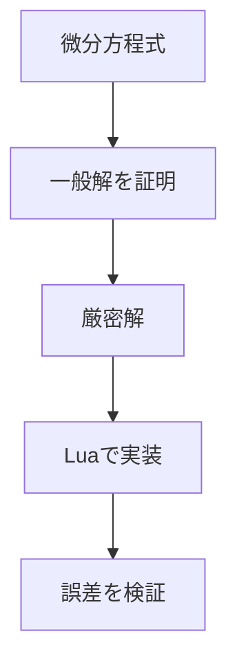
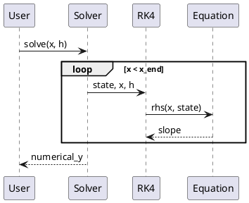

<!-- _class: cover -->

# テンプレートーAizome

## 一般解の証明から数値計算まで

水城アオ

---
<!-- _class: agenda -->

# 本日の構成

1. 解きたい問題を定義する
2. 一般解の構造を証明する
3. 具体的な方程式を解く
4. 数値計算として実装・検証する

---
<!-- _class: profile -->

# 自己紹介


## 水城アオ
架空のプロダクトエンジニア

- **経歴**：Web制作を経て、業務システムの設計・開発を担当

- **趣味**：街歩き、写真、コーヒー

- **最近の関心**：数式とコードをつなぐ説明

> 複雑なことを、シンプルに伝える。

[](https://github.com/)

---
<!-- _class: section -->

# 01. Problem

## 何を理解し、何を実装するのか

---

# 今回扱う問題

区間 $I$ 上で $P,Q,R$ が連続であるとし、2階非同次線形微分方程式

$$
y''+P(x)y'+Q(x)y=R(x)
$$

を考えます。

> ゴールは公式を暗記することではなく、一般解の構造を証明し、その構造をコードで確かめることです。

---
<!-- _class: cards -->

# 解くための3つの問い

- **構造**
  なぜ非同次方程式の一般解は「同次解＋特殊解」になるのか。

- **導出**
  特殊解を定数変化法でどのように求めるのか。

- **検証**
  数値計算で得た解が、厳密解と一致するか。

---
<!-- _class: table-center -->

# 記号と役割

| 記号 | 意味 | 満たす式 |
|---|---|---|
| $L$ | 線形微分作用素 | $L[y]=y''+Py'+Qy$ |
| $y_0$ | 同次方程式の一般解 | $L[y_0]=0$ |
| $y_1$ | 非同次方程式の特殊解 | $L[y_1]=R$ |
| $\phi_1,\phi_2$ | 同次方程式の基本解 | $L[\phi_i]=0$ |
| $W$ | ロンスキー行列式 | $W=\phi_1\phi_2'-\phi_1'\phi_2$ |

---
<!-- _class: section -->

# 02. Proof

## 一般解の構造を証明する

---

# 一般解の主張

線形微分作用素を

$$
L[y]=y''+P(x)y'+Q(x)y
$$

と定めます。同次方程式の任意の解を $y_0$、非同次方程式の特殊解を一つ $y_1$ とすると、

$$
\boxed{y=y_0+y_1}
$$

が非同次方程式の一般解になります。これを両方向から示します。

---

# 証明 1：和は非同次方程式を満たす

$L$ の線形性と $L[y_0]=0$, $L[y_1]=R$ より、

$$
\begin{aligned}
L[y_0+y_1]
&=L[y_0]+L[y_1] \\
&=0+R \\
&=R.
\end{aligned}
$$

したがって、任意の同次解 $y_0$ に特殊解 $y_1$ を加えたものは、必ず非同次方程式の解です。

---

# 証明 2：すべての解がこの形になる

非同次方程式の任意の解を $y$ とします。特殊解 $y_1$ との差を取ると、

$$
L[y-y_1]=L[y]-L[y_1]=R-R=0.
$$

よって $y-y_1$ は同次方程式の解です。これを $y_0$ と置けば、

$$
y-y_1=y_0
\quad\Longleftrightarrow\quad
y=y_0+y_1.
$$

以上により、非同次方程式の解は過不足なく $y_0+y_1$ と表されます。$\square$

---

# 同次方程式の一般解

線形独立な基本解を $\phi_1,\phi_2$ とすると、同次方程式の一般解は

$$
y_0=C_1\phi_1(x)+C_2\phi_2(x)
$$

です。線形独立性はロンスキー行列式で確認できます。

$$
W(x)=
\begin{vmatrix}
\phi_1(x) & \phi_2(x) \\
\phi_1'(x) & \phi_2'(x)
\end{vmatrix}
\neq0
$$

---

# 特殊解：定数変化法

定数 $C_1,C_2$ を関数 $u_1(x),u_2(x)$ に置き換え、

$$
y_1=u_1\phi_1+u_2\phi_2
$$

と仮定します。補助条件

$$
u_1'\phi_1+u_2'\phi_2=0
$$

を課すと、$y_1'=u_1\phi_1'+u_2\phi_2'$ となります。

---

# 定数変化法：代入する

もう一度微分して $L[y_1]=R$ に代入します。各 $\phi_i$ は同次方程式を満たすため、$u_i$ を含む項が消え、

$$
u_1'\phi_1'+u_2'\phi_2'=R
$$

だけが残ります。補助条件と合わせると、

$$
\begin{pmatrix}
\phi_1 & \phi_2 \\
\phi_1' & \phi_2'
\end{pmatrix}
\begin{pmatrix}u_1'\\u_2'\end{pmatrix}
=\begin{pmatrix}0\\R\end{pmatrix}.
$$

---

# 定数変化法：連立方程式を解く

$W\neq0$ なので、クラメルの公式から

$$
u_1'=-\frac{\phi_2R}{W},
\qquad
u_2'=\frac{\phi_1R}{W}
$$

を得ます。積分して $y_1=u_1\phi_1+u_2\phi_2$ に戻すと、

$$
y_1
=-\phi_1\int\frac{\phi_2R}{W}\,dx
+\phi_2\int\frac{\phi_1R}{W}\,dx.
$$

積分定数は同次解 $y_0$ に含められます。

---
<!-- _class: section -->

# 03. Example

## 証明した構造を具体例に適用する

---

# 解く方程式

初期値問題

$$
y''+3y'+2y=e^x,
\qquad y(0)=0,\quad y'(0)=0
$$

を解きます。対応する同次方程式の特性方程式は

$$
r^2+3r+2=(r+1)(r+2)=0
$$

なので、

$$
y_0=C_1e^{-x}+C_2e^{-2x}
$$

です。

---

# 定数変化法で特殊解を求める

$\phi_1=e^{-x}$, $\phi_2=e^{-2x}$ とすると、

$$
W=\phi_1\phi_2'-\phi_1'\phi_2=-e^{-3x}.
$$

$R=e^x$ を定数変化法の式へ代入すれば、

$$
u_1'=-\frac{\phi_2R}{W}=e^{2x},
\qquad
u_2'=\frac{\phi_1R}{W}=-e^{3x}.
$$

したがって、特殊解の一つは

$$
y_1=\frac12e^{2x}e^{-x}-\frac13e^{3x}e^{-2x}
=\frac16e^x
$$

です。

---

# 厳密解を得る

一般解は

$$
y=C_1e^{-x}+C_2e^{-2x}+\frac{1}{6}e^x
$$

です。$y(0)=0$, $y'(0)=0$ を代入すると、

$$
C_1+C_2=-\frac16,
\qquad
C_1+2C_2=\frac16.
$$

したがって $C_1=-\frac12$, $C_2=\frac13$ であり、

$$
\boxed{y(x)=-\frac12e^{-x}+\frac13e^{-2x}+\frac16e^x}
$$

を得ます。

---
<!-- _class: section -->

# 04. Implementation

## 同じ問題をコードで解く

---

# 1階の連立方程式へ変換する

$v=y'$ と置くと、2階方程式は

$$
\frac{d}{dx}
\begin{pmatrix}y\\v\end{pmatrix}
=
\begin{pmatrix}
v\\e^x-3v-2y
\end{pmatrix},
\qquad
\begin{pmatrix}y(0)\\v(0)\end{pmatrix}
=\begin{pmatrix}0\\0\end{pmatrix}
$$

という1階の連立方程式になります。

> 証明で解の構造を理解し、実装では状態 $(y,v)$ がどう変化するかを小さな刻み幅で追跡します。

---

# 方程式と厳密解をコードにする

```lua
local function rhs(x, state)
  local y, velocity = state[1], state[2]

  return {
    velocity,
    math.exp(x) - 3 * velocity - 2 * y,
  }
end

local function exact(x)
  return -0.5 * math.exp(-x)
    + (1 / 3) * math.exp(-2 * x)
    + (1 / 6) * math.exp(x)
end
```

Luaのテーブルで状態 $\{y,v\}$ を表します。外部ライブラリは使用しません。

---
<!-- _class: dense -->

# 4次のRunge–Kutta法を実装する

```lua
local function shifted(state, slope, scale)
  return {
    state[1] + scale * slope[1],
    state[2] + scale * slope[2],
  }
end

local function rk4_step(f, x, state, h)
  local k1 = f(x, state)
  local k2 = f(x + h/2, shifted(state, k1, h/2))
  local k3 = f(x + h/2, shifted(state, k2, h/2))
  local k4 = f(x + h, shifted(state, k3, h))

  return {
    state[1] + h * (k1[1] + 2*k2[1] + 2*k3[1] + k4[1]) / 6,
    state[2] + h * (k1[2] + 2*k2[2] + 2*k3[2] + k4[2]) / 6,
  }
end
```

1ステップで傾きを4回評価し、その加重平均で状態を更新します。

---

# 初期値から数値解を計算する

```lua
local function solve(x_end, h)
  local x = 0.0
  local state = { 0.0, 0.0 }

  while x < x_end - h/2 do
    state = rk4_step(rhs, x, state, h)
    x = x + h
  end

  return state[1]
end

for _, x in ipairs({ 0.5, 1.0, 1.5, 2.0 }) do
  local numerical = solve(x, 0.01)
  print(x, numerical, exact(x))
end
```

同じ初期値から各点まで計算し、厳密解との差を確認します。

---
<!-- _class: table-center -->

# 数値解を厳密解と照合する

刻み幅を $h=0.01$ とした結果です。

| $x$ | RK4による数値解 | 厳密解 | 絶対誤差 |
|---:|---:|---:|---:|
| $0.0$ | 0.000000000 | 0.000000000 | $0$ |
| $0.5$ | 0.094148029 | 0.094148029 | $5.04\times10^{-11}$ |
| $1.0$ | 0.314219012 | 0.314219012 | $9.11\times10^{-11}$ |
| $1.5$ | 0.651978787 | 0.651978788 | $2.77\times10^{-10}$ |
| $2.0$ | 1.169946921 | 1.169946921 | $5.21\times10^{-10}$ |

数値解は、この範囲では厳密解と高い精度で一致しました。

---

# 証明から実装までを振り返る

1. 線形性から、一般解が $y=y_0+y_1$ と分解できることを証明した。
2. 定数変化法により、特殊解を構成する手順を導いた。
3. 具体例を解析的に解き、比較対象となる厳密解を得た。
4. 方程式を1階化してRK4法で実装し、計算結果を検証した。

> 数式は「なぜ正しいか」を説明し、コードは「実際にどう振る舞うか」を確かめる。両方をつなぐことで、理解が検証可能になります。

---
<!-- _class: section -->

# Appendix

## テキスト記法と画像を使うレイアウト

---
<!-- _class: image-right -->


# LilyPondで楽譜を配置する

```lilypond
rightHand = \relative c'' {
  \key a \minor
  \time 4/4
  a4\p( c e a) | g2( e) |
  f4( a c b) | a2.( e4) |
  d4( f a d) | c2( a) |
  b4( gis e gis) | a2.( e4) |
  % ... 全16小節
}
```

`.ly` をSVGへ変換し、通常の画像として配置します。

---
<!-- _class: image-right -->


# Mermaidで処理フローを描く



`.mmd` からSVGを生成し、説明の流れを可視化します。

---
<!-- _class: image-right -->


# PlantUMLで処理順を描く



`.puml` からSVGを生成し、コードの呼び出し関係を示します。

---
<!-- _class: image-right -->


# 横半分に画像を配置する

本文と画像を同じ比重で見せたい場合のレイアウトです。

- 画像はスライドの右半分に配置
- 左側には結論と短い説明を記載
- `right` を `left` に変えると左右を反転

---
<!-- _class: full-image -->


# 全画面に画像を配置する

画像そのものを主役にし、文章は短いメッセージだけに絞ります。

---
<!-- _class: closing -->

# Thank you

証明した構造を、動くコードへ。
