<!-- 資料全体の配色は冒頭のthemeを変更：aizome / aizome-aonibi / aizome-murasaki / aizome-kohaku / aizome-sumi。 -->
<!-- _class: cover -->

# Aizome スライドパターン集

## 伝えたいことから、レイアウトを選ぶ

Markdownでつくるプレゼンテーション｜水城アオ

---

<!-- _class: list -->

# 目的からテンプレートを選ぶ

1. **導入・本文** [3〜8枚目](#3)
2. **カード・比較・数値** [9〜17枚目](#9)
3. **時系列・画面遷移** [18〜22枚目](#18)
4. **画像・図版** [23〜33枚目](#23)
5. **コード・数式** [34〜37枚目](#34)
6. **配色・余白・見出し** [38〜41枚目](#38)
7. **ビジネス設計** [42〜49枚目](#42)
8. **結論・補足** [50〜55枚目](#50)

---

<!-- _class: section -->

# 01. 導入・本文

## 要点を伝え、話し手を紹介する

---

# 基本の本文

## 1枚につき、伝えたいことは1つ

見出しで結論を示し、本文で背景を補います。

- 箇条書きは3〜5項目を目安にする
- **重要な言葉**だけを強調する
- 詳しい情報は別のスライドに分ける

> 補足や注意点は引用記法で添えられます。

---

<!-- _class: lead -->

# キーメッセージ

## 伝わる資料は、選びやすい。

情報の役割に合ったレイアウトを選ぶことで、読み手の理解を助けます。

---

<!-- _class: quote -->

# 引用・参加者の声

> 必要な情報をすぐに見つけられると、
> 次の行動に迷わなくなります。

ユーザーインタビューより（架空のコメント）

---

<!-- _class: profile avatar-circle -->

# プロフィール：右に丸形の写真


## 水城アオ

**プロダクトエンジニア** ｜ 東京（サンプル）

使う人の課題を整理し、伝わる画面と動く仕組みをつくります。
設計から実装、使い始めたあとの改善まで担当しています。

- **これまで**

  Web制作から業務システム開発、プロダクト改善へ。
- **得意なこと**

  UI設計・フロントエンド開発・情報の可視化。
- **関心と好きなこと**

  チームの知識共有。休日は街歩きと写真、コーヒー。

> 小さくつくり、使いながら磨く。

[ GitHub](https://github.com/) [ X](https://x.com/) [ LinkedIn](https://www.linkedin.com/) [ Website](https://example.com/)

---

<!-- _class: faq -->

# よくある質問

## HTMLは必要ですか？

不要です。通常のMarkdownとMarpのディレクティブで記述します。

## カードの中に箇条書きを置けますか？

はい。カードを表すリストの中に、インデントしてリストを書きます。

## 文章が入りきらないときは？

内容を分割し、必要に応じて `dense` クラスを使います。

---

<!-- _class: section -->

# 02. カード・比較・数値

## 情報を並べ、違いと大きさを見せる

---

<!-- _class: cards card-top -->

# カード：項目数に合わせて並べる

- **見つける**

  必要な情報へたどり着く。
- **理解する**

  要点と根拠を確認する。
- **動く**

  次の行動を選ぶ。

指定：`cards card-top`。項目数を数えて1〜3枚は1行、4枚は2×2、5〜6枚は3×2に配置します。

---

<!-- _class: cards card-middle card-text-center -->

# カード：6項目を上下中央に

- **目的**

  何を達成するか
- **利用者**

  誰のためにつくるか
- **場面**

  いつ使われるか
- **情報**

  何を伝えるか
- **操作**

  何をしてもらうか
- **評価**

  どう確かめるか

指定：`cards card-middle card-text-center`。`four`・`grid` の指定は不要です。

---

<!-- _class: stat with-notes -->

# ひとつの数字を強調

## 32%

**作業時間を短縮**

改善前後の平均所要時間を比較。※1

> ※1 同じ操作を対象に比較した架空データです。
>
> 注釈は `with-notes` と末尾の引用で配置。条件や出典を短い2行にまとめます。

---

<!-- _class: comparison-table captioned with-source -->
<!-- _footer: 出典：テンプレート用の架空プラン｜`with-source` と `_footer` で1行の出典を配置 -->

# 比較表

###### 表1：プラン比較

| 観点 | プランA | プランB | プランC |
|---|---|---|---|
| 導入規模 | 個人 | チーム | 全社 |
| 設定の自由度 | 小 | 中 | 大 |
| 運用の負担 | 小 | 中 | 大 |
| 向いている用途 | 試用 | 部門運用 | 共通基盤 |

---

<!-- _class: matrix -->

# 優先順位マトリクス

| | 効果が小さい | 効果が大きい |
|---|---|---|
| **負担が小さい** | 余力があれば実施 | **最初に取り組む** |
| **負担が大きい** | 見送る | 計画して取り組む |

---

<!-- _class: dense -->

# 詳細表・付録

| 項目 | 確認すること | 担当 | タイミング | 状態 |
|---|---|---|---|---|
| 目的 | 成功条件を定義 | 企画 | 開始前 | 完了 |
| 対象 | 利用部門を選定 | 企画 | 開始前 | 完了 |
| 画面 | 主な操作を設計 | 設計 | 試作時 | 完了 |
| データ | 入出力を確認 | 開発 | 実装時 | 確認中 |
| 品質 | 主要な操作を検証 | 開発 | 公開前 | 予定 |
| 運用 | 問い合わせ先を整備 | 運用 | 公開前 | 予定 |
| 効果 | 所要時間を測定 | 企画 | 公開後 | 予定 |

`dense`：左右の余白を残して表を全幅に表示。20pxの文字で、詳細項目を読みやすく並べます。

---

<!-- _class: cards focus-right before-after card-middle -->

# Before / After：変更による違いを伝える

- **Before｜情報が分散**

  申請先を探す必要がある。

  進捗を個別に問い合わせる。
- **After｜窓口をひとつに**

  同じ画面から申請できる。

  進捗をいつでも確認できる。

指定：`cards focus-right before-after card-middle`。左右で同じ観点・順番をそろえると、変化が伝わります。

---

<!-- _class: cards focus-center card-top -->

# 3案比較：条件と推奨理由をそろえる

- **A｜現状を改善**

  導入負担：小

  効果：限定的

  手順の見直しで対応。
- **B｜段階的に移行（推奨）**

  導入負担：中

  効果：検証しながら拡大

  まず1チームで試す。
- **C｜全体を刷新**

  導入負担：大

  効果：全体最適を狙う

  移行計画を別途用意。

`cards focus-center`。強調位置は `focus-left` / `focus-center` / `focus-right`。推奨理由は文章でも示します。

---

<!-- _class: section -->

# 03. 時系列・画面遷移

## 順序と連続性を伝える

---


<!-- _class: timeline split -->

# 時系列：縦2列・番号なし

1. **4月｜調査**

   課題を集める
2. **5月｜設計**

   仮説を形にする
3. **6月｜試作**

   操作を確認する
4. **7月｜検証**

   利用者の声を聞く
5. **8月｜改善**

   気づきを反映する
6. **9月｜展開**

   利用を広げる
7. **10月｜計測**

   効果を確かめる
8. **11月｜運用**

   手順を整える

指定：`timeline split`。左下から右上へ続きます。`split` を外すと縦1列、`numbered` を追加すると番号付き。

---

<!-- _class: timeline horizontal -->

# 時系列：横1段・番号なし

1. **4月｜調査**

   課題を集める
2. **5月｜設計**

   仮説を形にする
3. **6月｜試作**

   操作を確認する
4. **7月｜検証**

   利用者の声を聞く
5. **8月｜改善**

   気づきを反映する

指定：`timeline horizontal`。左から右へ進みます。6項目までが目安です。

---

<!-- _class: timeline horizontal split numbered -->

# 時系列：横2段・番号あり

1. **4月｜調査**

   課題を集める
2. **5月｜設計**

   仮説を形にする
3. **6月｜試作**

   操作を確認する
4. **7月｜検証**

   利用者の声を聞く
5. **8月｜改善**

   気づきを反映する
6. **9月｜展開**

   利用を広げる
7. **10月｜計測**

   効果を確かめる
8. **11月｜運用**

   手順を整える

指定：`timeline horizontal split numbered`。上段の右端から、下段の左端へ続きます。

---

<!-- _class: screen-flow -->

# スマホの画面遷移：3〜4画面を自動配置

1. 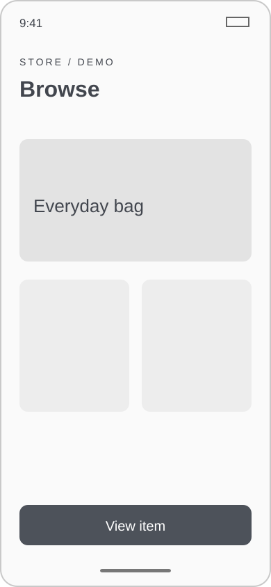

   **01. 一覧**

   商品を選ぶ
2. 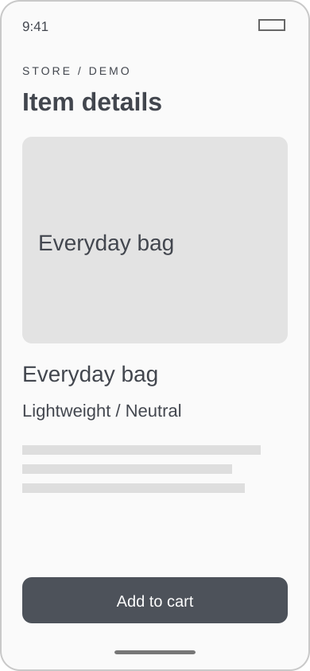

   **02. 詳細**

   内容を確認する
3. 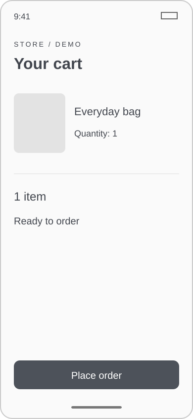

   **03. カート**

   注文を確定する
4. 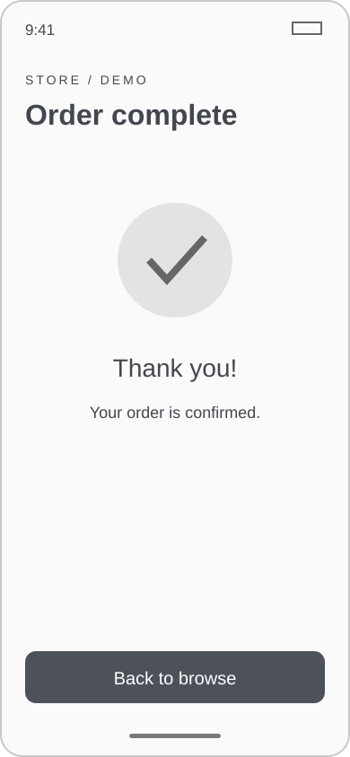

   **04. 完了**

   一覧へ戻る

指定：`screen-flow`。3〜4画面を自動配置。`no-title` を追加するとタイトル領域を画像に使えます。

---

<!-- _class: section -->

# 04. 画像・図版

## 比率を選び、図や写真を余白の中に収める

---

<!-- _class: media media-right ratio-1x1 -->

# 1:1の画像を使う

- 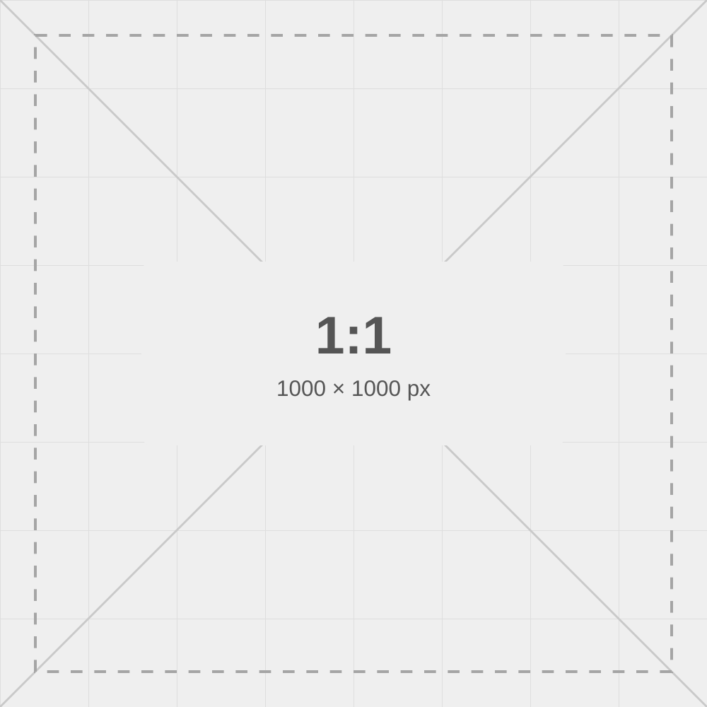
- **正方形の商品写真やジャケットに**

  元画像の縦横比に合う枠を選び、全体をそのまま収めます。

  **指定**：`media media-right` ＋ `ratio-1x1`

  左配置は `media-left`。枠を埋めて切り抜く場合は `fit-cover` を追加します。

---

<!-- _class: media media-right ratio-16x9 -->

# 16:9の画像を使う

- 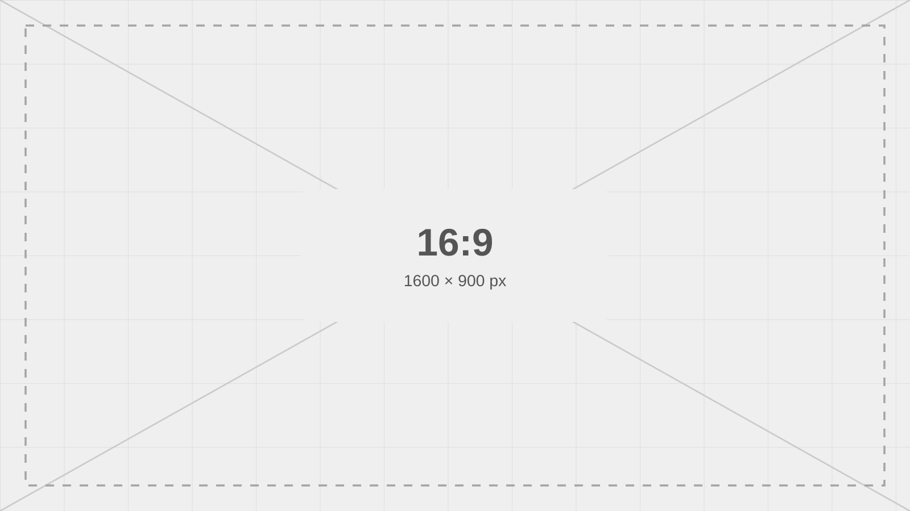
- **横長の画面キャプチャや動画に**

  元画像の縦横比に合う枠を選び、全体をそのまま収めます。

  **指定**：`media media-right` ＋ `ratio-16x9`

  4:3の画像には `ratio-4x3`。左配置は `media-left`。枠を埋めて切り抜く場合は `fit-cover` を追加します。

---

<!-- _class: media media-right ratio-9x16 -->

# 9:16の画像を使う

- 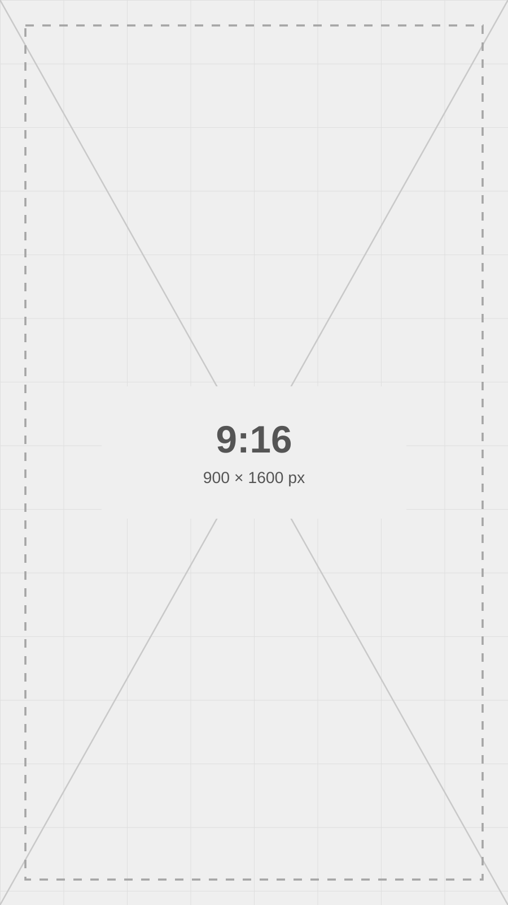
- **スマートフォンの画面や縦動画に**

  元画像の縦横比に合う枠を選び、全体をそのまま収めます。

  **指定**：`media media-right` ＋ `ratio-9x16`

  3:4の画像には `ratio-3x4`。左配置は `media-left`。枠を埋めて切り抜く場合は `fit-cover` を追加します。

---

<!-- _class: figure no-title captioned -->

# 大きな画像：1枚を主役に


###### 図1：大きな画像の配置

<!-- 指定：figure no-title captioned。画像はh:560で縦横比を維持し、外周の余白と図表名の領域を確保。タイトルを出す場合はno-titleを外し、h:440にする。3:1のパノラマはREADMEの設定例を参照。 -->

---


<!-- _class: gallery image-grid -->

# 縦長画像：全体表示と切り抜き

- 

  **contain**：全体が入り、左右に余白が残る
- 

  **cover**：枠を埋め、上下が切れる

**指定**：`gallery image-grid`。全体表示は ``、切り抜きは ``。上端を残す場合は `crop-top`。

---

<!-- _class: full-image -->

# 画像を主役にする

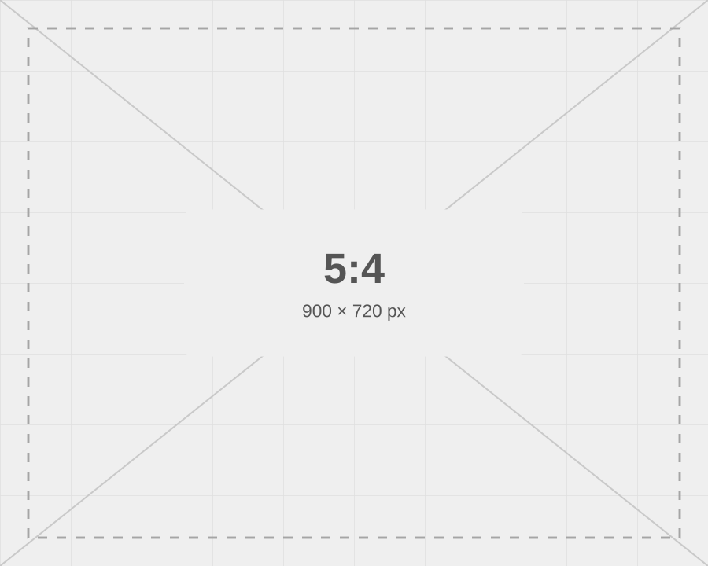

メッセージを短く、印象を大きく。

指定：`full-image` と ``

---

<!-- _class: media media-right diagram nested-alpha -->

# フロー図＋解説

- 
- **問題から検証まで**

  1. 解の構造を理解する
  2. 厳密解を求める
  3. 実装して誤差を確認する

  番号は `nested-alpha` で a・b・c。`nested-kana` はア・イ・ウ、`nested-roman` は i・ii・iii。

  **指定**：`media media-right diagram`。図の内側24px、本文との間48pxを確保します。

---

<!-- _class: figure no-title -->

# シーケンス図を大きく見せる

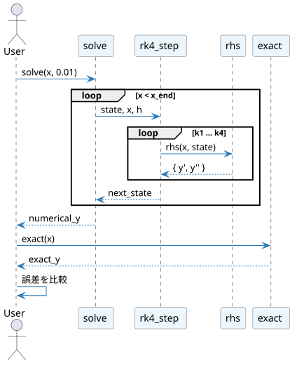

<!-- 指定：figure no-title。タイトルと説明文を省き、図全体を中央に表示。h:600で上下60pxの余白を確保し、縦横比を維持します。 -->

---

<!-- _class: image-detail -->

# 全体＋拡大：注目してほしい箇所を見せる

- 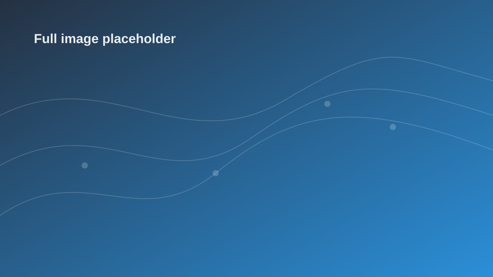

  **全体**｜中央のラベルに注目します。
- 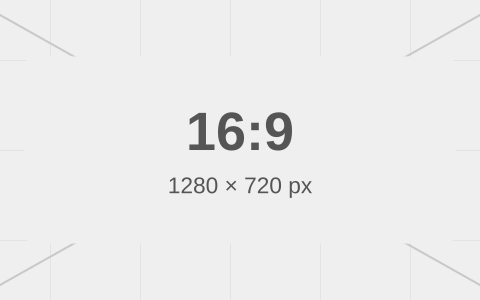

  **拡大**｜同じ箇所を大きく見せます。

`image-detail`。画像2枚を順に書き、各画像の下に説明を添えます。

拡大部分は切り出した画像を用意します。`detail-left` を追加すると左右を入れ替えられます。

---

<!-- _class: gallery -->

# グラフ：比較・推移・構成比

- 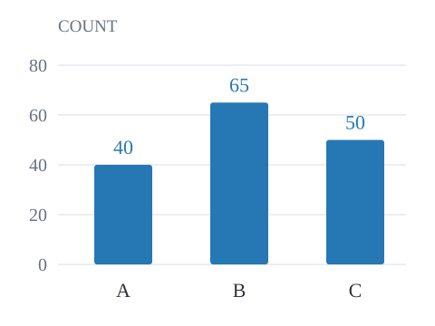

  **棒：項目を比較**
- 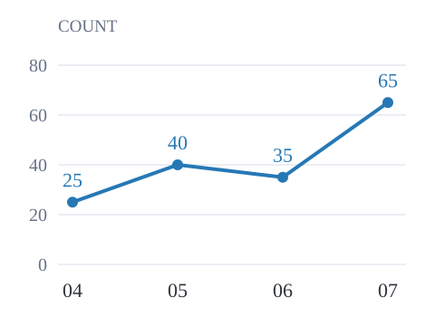

  **折れ線：推移を追う**
- 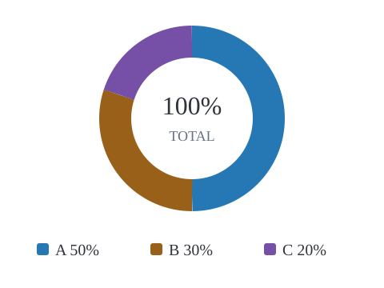

  **ドーナツ：割合を示す**

`` で挿入。1枚を大きく見せるなら `figure`、説明を添えるなら `media media-right diagram`。

数値は架空の作例です。自分のグラフ画像に差し替えて使います。配色・更新方法はREADMEを参照。

---

<!-- _class: section -->

# 05. コード・数式

## 実装と根拠を読みやすく見せる

---

<!-- _class: code code-dark -->

# コードを大きく見せる

```python
def average(values):
    if not values:
        raise ValueError("values must not be empty")
    return sum(values) / len(values)


result = average([12, 18, 24])
print(result)  # 18.0
```

`code-dark` でコード欄を黒背景に。言語名はコード欄の左上に表示します。

---

<!-- _class: cards code-notes -->

# コード＋解説

- **実装**

  ```python
  def normalize(text):
      return text.strip().lower()

  print(normalize(" Aizome "))
  ```
- **処理のポイント**
  - 前後の空白を取り除く
  - 小文字に統一する
  - 表記の揺れを減らす

---

<!-- _class: equation -->

# 数式を中心に説明

$L[y_0]=0$、$L[y_1]=R$ とすると、線形性より

$$
\begin{aligned}
L[y_0 + y_1] &= L[y_0] + L[y_1] \\
&= 0 + R = R.
\end{aligned}
$$

- $L$：線形作用素
- $y_0, y_1$：作用素を適用する関数

> `$$ ... $$` で独立した数式、`aligned` で複数行の導出を揃えます。

---


<!-- _class: section -->

# 06. 配色・余白・見出し

## 必要な指定を組み合わせる

---

<!-- _class: palette-catalog -->

# 配色一覧：6色を見比べる

- **藍**

  `palette-ai`

  ***蛍光ペン風***の強調
- **青鈍**

  `palette-aonibi`

  ***蛍光ペン風***の強調
- **紫**

  `palette-murasaki`

  ***蛍光ペン風***の強調
- **琥珀**

  `palette-kohaku`

  ***蛍光ペン風***の強調
- **灰桜**

  `palette-haizakura`

  ***蛍光ペン風***の強調
- **墨**

  `palette-sumi`

  ***蛍光ペン風***の強調

配色は `palette-ai` などを追加。蛍光ペン風の強調は `***重要な言葉***`。

`marker-kohaku`：線だけ琥珀色 ／ `emphasis`：太字に色 ／ `surface-tint`・`surface-dark`：背景

---

<!-- _class: emoji-catalog -->

# 絵文字コード：よく使う18種類

| 表示 | コード | 表示 | コード | 表示 | コード |
|---|---|---|---|---|---|
| :smile: | `:smile:` | :thumbsup: | `:thumbsup:` | :clap: | `:clap:` |
| :tada: | `:tada:` | :bulb: | `:bulb:` | :mag: | `:mag:` |
| :book: | `:book:` | :memo: | `:memo:` | :rocket: | `:rocket:` |
| :gear: | `:gear:` | :wrench: | `:wrench:` | :computer: | `:computer:` |
| :white_check_mark: | `:white_check_mark:` | :warning: | `:warning:` | :x: | `:x:` |
| :calendar: | `:calendar:` | :chart_with_upwards_trend: | `:chart_with_upwards_trend:` | :sparkles: | `:sparkles:` |

本文や見出しに `:rocket:` と書くと :rocket: と表示されます。追加のクラス指定は不要です。

コード自体を見せたいときはバッククォートで囲みます。例：`:smile:`。画像はMarp標準の配信元から読み込みます。

---

<!-- _class: title-long section-title cards -->
<!-- _header: 06 / 配色・余白・見出し -->

# 小さなセクション名を添え、長いタイトルも文字を縮めずに本文と余白を分けて伝える

- **見出しの役割**

  セクション名で資料内の位置を示し、タイトルでこの1枚の結論を伝えます。

  `no-title` を追加すると、見出しとその領域を取り除きます。
- **好きな位置に余白を足す**

  ``

  

  この上に24px追加。前後に空行を置き、カード内ではインデントします。

`vspace-xs / sm / md / lg / xl / 2xl`：8 / 16 / 24 / 32 / 48 / 64px。通常の段落間隔に加算します。

`title-long section-title`：タイトルは34px・2行まで。短いタイトルでは `title-long` を外せます。

---

<!-- _class: section -->

# 07. ビジネス設計

## 顧客理解から、事業の仮説と施策へ

---

<!-- _class: journey -->

# カスタマージャーニーマップ

対象：初めて導入する店舗オーナー ／ 目的：予約受付を開始する（架空の仮説）

| 観点 | 認知 | 比較 | 申込 | 初回利用 | 継続 |
|---|---|---|---|---|---|
| **行動** | 紹介記事を読む | 料金を調べる | 店舗を登録 | 予約枠を公開 | 実績を確認 |
| **接点** | 検索・紹介 | 料金ページ | 登録フォーム | 管理画面 | 月次メール |
| **考え** | 自店に合う？ | 総額はいくら？ | 設定は大変？ | 正しく動く？ | 効果は出た？ |
| **感情** | 期待 | 迷い | 不安 | 安心 | 納得 |
| **課題** | 利用像が曖昧 | 追加料金が不明 | 入力が多い | 完了が分からない | 効果を測れない |
| **改善機会** | 業種別の実例 | 総額の試算 | 入力項目を削減 | 公開結果を表示 | 予約実績を可視化 |

`journey`：4〜5段階・5〜6観点が目安。感情は調査で確かめ、事実と仮説を区別します。

---

<!-- _class: canvas -->

# リーンキャンバス：予約管理サービス

- **課題**

  電話対応で作業が止まる。

  **既存の代替**

  紙の台帳と電話。
- **解決策**

  予約枠を公開し、受付を自動化。
- **主要指標**

  初回公開率と週次の予約件数。
- **独自の価値提案**

  接客中でも予約を取り逃さない。

  小さな店舗のための受付窓口。
- **圧倒的な優位性**

  地域の店舗との関係。現時点では仮説。
- **チャネル**

  店舗紹介・地域団体・検索。
- **顧客セグメント**

  ひとりで営む予約制店舗。

  **初期顧客**

  電話対応に困る美容室。
- **コスト構造**

  開発・運用・問い合わせ対応。
- **収益の流れ**

  店舗ごとの月額利用料。

`canvas`：9項目をこの順に記載。内容は架空の仮説です。課題・顧客から検証します。

---

<!-- _class: canvas -->

# ビジネスモデルキャンバス

- **主要パートナー**

  地域の商工団体。

  決済サービス事業者。
- **主要活動**

  予約機能の開発と導入支援。
- **主要リソース**

  開発チームと店舗の運用知見。
- **価値提案**

  受付作業を減らし、接客へ集中できる。

  予約の取りこぼしを減らす。
- **顧客との関係**

  初回の設定支援と継続サポート。
- **チャネル**

  地域団体・紹介・自社サイト。
- **顧客セグメント**

  予約制の小規模店舗。

  店舗利用者も予約画面を使う。
- **コスト構造**

  開発費・サーバー費・支援の人件費。
- **収益の流れ**

  月額利用料と初期設定支援料。

`canvas`：同じ9枠を再利用。架空の例です。各枠が価値提供と収益につながるか確認します。

---

<!-- _class: cards card-top -->

# SWOT：内外の要因を分ける

- **S｜強み・内部**

  S1：店舗と直接つながる。

  S2：設定手順が少ない。
- **W｜弱み・内部**

  W1：知名度が低い。

  W2：支援できる人数が少ない。
- **O｜機会・外部**

  O1：省力化への需要がある。

  O2：地域団体が導入を支援する。
- **T｜脅威・外部**

  T1：大手が低価格で参入する。

  T2：繁忙期に移行が進まない。

`cards card-top`：4項目で2×2に自動配置。架空の仮説です。根拠・対象期間は別途確認します。

---

<!-- _class: matrix matrix-neutral -->

# クロスSWOT：要因から施策を導く

| 外部 × 内部 | S：強みを使う | W：弱みを補う |
|---|---|---|
| **O：機会** | **SO｜S1 × O2** 地域団体と体験会を開く | **WO｜W1 × O2** 団体の紹介で認知を広げる |
| **T：脅威** | **ST｜S2 × T1** 設定の簡単さで差別化する | **WT｜W2 × T2** 導入時期を分散し、支援枠を絞る |

前ページの要因IDと対応付けた架空の施策です。実施前に効果・工数・検証方法をそろえます。

`matrix matrix-neutral`：2軸の表を再利用。特定の象限だけを強調せずに比較します。

---

<!-- _class: comparison-table -->

# 競合分析：顧客の選択肢を比べる

| 比較軸 | 自社案 | 競合A | 現状の代替 |
|---|---|---|---|
| **対象** | 小規模店舗 | 多店舗運営 | 電話と台帳 |
| **強み** | 設定が簡単 | 管理機能が豊富 | 新規費用が不要 |
| **制約** | 高度な分析は未対応 | 初期設定が必要 | 手作業が残る |
| **導入負担** | 入力項目を限定 | 業務設定が必要 | 既存運用を継続 |
| **確認すること** | 実際の公開時間 | 最新の提供条件 | 対応に使う時間 |

`comparison-table`：直接競合だけでなく「何もしない」選択肢も比較。すべて架空の例です。

---

<!-- _class: dense -->

# 施策の優先順位：根拠と工数をそろえる

| 施策 | 到達人数／月 | 効果 | 確信度 | 工数／人月 | 評価値 |
|---|---:|---:|---:|---:|---:|
| 初回ガイド | 200 | 2 | 80% | 2 | **160** |
| 料金の試算 | 100 | 2 | 60% | 1 | **120** |
| 月次レポート | 150 | 1 | 80% | 2 | **60** |
| 高度な分析 | 50 | 3 | 40% | 3 | **20** |

評価値＝到達人数 × 効果 × 確信度 ÷ 工数。数値は架空の例で、自動計算ではありません。

`dense`：比較期間・効果の尺度を統一。依存関係や必須対応も考慮して順番を決めます。

---

<!-- _class: section -->

# 08. 結論・補足

## 判断と次の行動につなげる

---

<!-- _class: decision -->

# 提案・意思決定

> まずは1チームで試験運用を始めることを提案します。

- **理由**：実際の作業で効果と課題を把握できる
- **条件**：2週間で主要な操作を検証する
- **判断**：完了率と所要時間をもとに展開を決める

---

<!-- _class: action -->

# 次のアクション

| やること | 担当 | 期限 |
|---|---|---|
| 対象チームの選定 | 企画担当 | 今週末 |
| 試作品のレビュー | 設計担当 | 来週火曜 |
| 検証の開始 | チーム全員 | 来週木曜 |

> 次回は検証結果と改善案を共有します。

---

<!-- _class: risk-action -->

# 課題・対応・判断条件を1枚にまとめる

| 課題 | 対応 | 確認する時点 |
|---|---|---|
| 利用方法が伝わらない | 初回ガイドを追加し、操作を観察する | 試験導入の初週 |
| 移行作業が集中する | 対象を分けて、順番に移行する | 各チームの開始前 |
| 効果が見えにくい | 所要時間と完了率を記録する | 導入から2週間後 |

指定：`risk-action`。3〜4件を目安に、懸念だけでなく対応と確認時点までそろえます。

---

<!-- _class: references -->

# 参考資料・リンク

- [Marp](https://marp.app/) — スライド作成ツール
- [表1：プラン比較](#表1プラン比較) — 提供条件を比較する表
- [図1：大きな画像の配置](#図1大きな画像の配置) — 画像の配置例
- [テーマと使い方](README.md) — このリポジトリのガイド
- [図のソース](diagrams/solution-flow.mmd) — 編集可能なMermaidの例
- [楽譜のソース](music/example.ly) — 編集可能なLilyPondの例

図表名を `######` で付け、`[表1](#表1プラン比較)` で参照できます。番号は手動です。

---

<!-- _class: closing -->

# Thank you

## 次のスライドを、Markdownから。

水城アオ｜[GitHub](https://github.com/)
