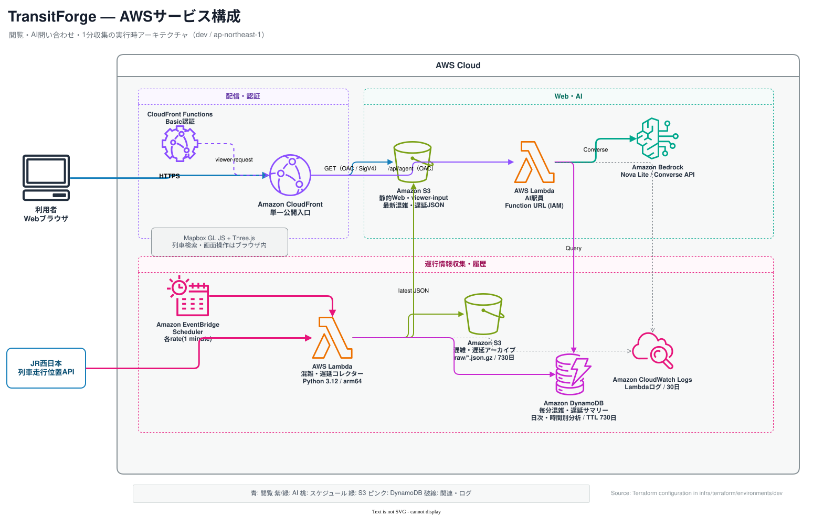
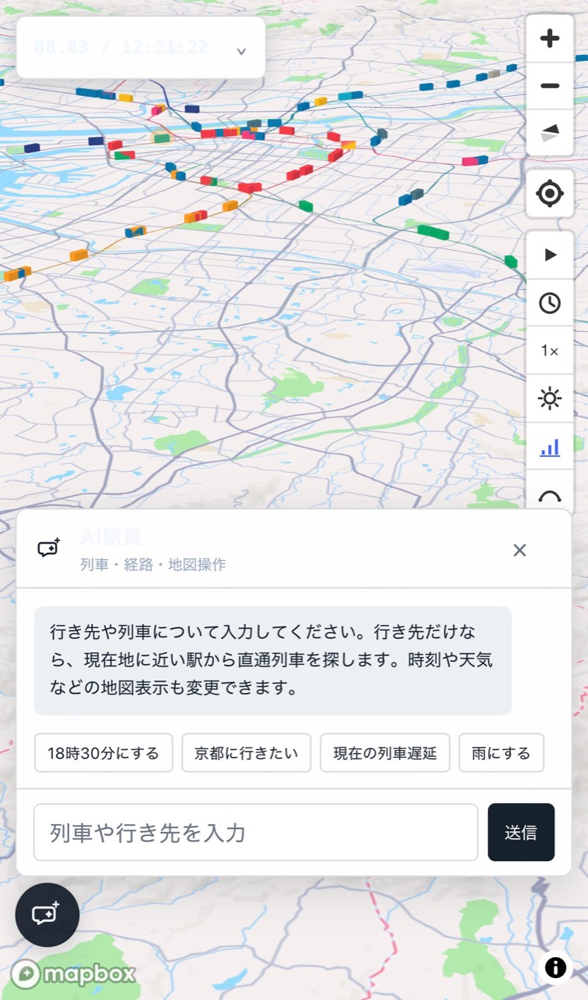
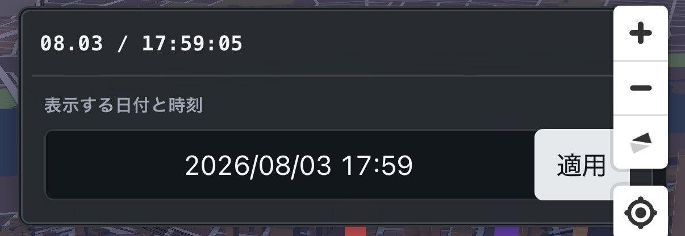

<!-- _class: cover -->

# TransitForge

## 鉄道運行を、眺めて・尋ねて・動かす

時刻表・経路・リアルタイム情報・生成AIを、ひとつの地図体験へ

2026.08　ymho

---

<!-- _class: quote -->

# 出発点

> 時刻表の数字ではなく、列車が今どこを走り、次にどこへ向かうのかを直感的に見たい。

公開データを集めるだけでなく、**毎日生成し、安定して届け、自然に操作できる**ところまでを対象にした。

---

<!-- _class: cards -->

# つくったもの

- **地図で眺める** 
  MapboxとThree.jsで、選択時刻に走る列車を3D地図上へ表示
- **状況を重ねる** 
  遅延・混雑・天気を1分単位の情報として可視化
- **AI駅員に尋ねる** 
  列車・直通経路・時刻・地図表示を会話から操作

表示するのは列車アイコンだけではない。列車を選べば、停車駅・列車番号・行き先・遅延を追える。

---

<!-- _class: flow -->

# 列車が地図に現れるまで

1. **時刻表を正規化** 
   列車・駅・発着時刻を共通形式へ
2. **鉄道グラフを構築** 
   国土数値情報から線路と駅を接続
3. **列車経路を探索** 
   列車ごとの通過パスを生成
4. **ブラウザで補間** 
   選択時刻の位置を求めて3D描画

---

<!-- _class: columns -->

# 日次データ生成を別サービスに分離

- **TransitForge Data Builder** 
  Pythonで全件を毎日再生成 
  中間データと診断結果を保持 
  公開成果物は2ファイルだけ
- **安全な公開契約** 
  03:00　日付付き非公開領域へ生成 
  04:00　2ファイルの完全性を確認 
  成功した当日分だけ固定キーへ昇格

`train_index.json` と `path_catalog.json` を境界に、生成処理とViewerを疎結合にした。

---

<!-- _class: diagram -->

# AWS実行時アーキテクチャ

---

<!-- _class: diagram -->

# GitHubからAWSへ、安全に届ける

---

<!-- _class: cards -->

# 運用で重視した3つの性質

- **再現できる** 
  TerraformでAWS構成をコード化し、環境差分を抑える
- **壊れた成果物を出さない** 
  日付付きステージングと完全性確認後の昇格を分離
- **追跡できる** 
  最新値・履歴・DynamoDBの分サマリーを用途別に保存

GitHub ActionsはOIDCでAWSへ接続し、固定アクセスキーを持たない。

---

<!-- _class: columns -->

# AI駅員：大量データを、そのままAIへ渡さない

- **ブラウザ側の役割** 
  時刻表と現在位置から候補を検索 
  直通列車を最大3件に絞る 
  現在地に近い発駅を端末内で推定
- **Bedrock側の役割** 
  会話の意図を解釈 
  必要なツール操作を選択 
  絞り込まれた結果を自然な文章で案内

現在位置はAIにもAWSにも送らない。**計算場所の設計を、プライバシー設計にした。**

---

<!-- _class: screens -->

# スマホ実機の違和感を、改善の入口に

-  
  **表示と入力の密度** 
  AIパネル、候補、地図操作が小画面で競合。文字コントラストも実機で確認した。
-  
  **時刻編集の操作量** 
  大きな編集パネルを廃止し、日付表示を直接編集できる形へ単純化した。

---

<!-- _class: compare -->

# 地図の時間帯と、UIのテーマを揃える

- **地図は4段階を維持** 
  朝・昼・夕方・夜 
  時間帯ごとのMapbox表現をそのまま活かす
- **UIは2段階に集約** 
  朝＋昼 → デイモード 
  夕方＋夜 → ナイトモード

ローディング、AI駅員、時刻、列車詳細まで同じ基準で切り替え、地図と操作面の印象を一致させた。

---

<!-- _class: kpi -->

# 現在地 — 3週間で運用まで

- **51** 
  TransitForge commits
- **107** 
  frontend tests
- **1分** 
  遅延・混雑の更新周期
- **毎日** 
  全件生成＋安全な昇格

2026年7月12日の初期コミットから、8月3日時点。Data Builderは別リポジトリとして独立運用。

---

<!-- _class: roadmap -->

# 取り組みの変化

1. **見える** 
   時刻表と線路から列車を3D表示
2. **わかる** 
   遅延・混雑・詳細情報を統合
3. **尋ねられる** 
   AI駅員と直通経路検索を追加
4. **任せられる** 
   日次生成、監視、CI/CDをAWSで運用

---

<!-- _class: cards -->

# この開発から得たこと

- **境界を小さくする** 
  公開成果物を2ファイルに絞ると、変更と障害の影響範囲が読める
- **実機で初めて見える問題がある** 
  フォーカス、キーボード、密度、コントラストはスマホで判断する
- **AIより先に検索を設計する** 
  候補抽出を決定的処理に寄せるほど、応答は速く説明可能になる

---

<!-- _class: decision -->

# 次に伸ばすなら

> 「直通で行ける」を確実にした次は、乗換を含む経路を、同じ自然な会話で扱えるようにする。

- 乗換探索の評価基準：到着時刻、乗換回数、歩行・待ち時間
- 実運用の観測：データ鮮度、AIツール成功率、モバイル操作性
- 現行のシンプルな地図体験を崩さず、段階的に追加する

---

<!-- _class: closing -->

# TransitForge

## 鉄道データを「見る」から、運行を「理解して動かす」体験へ。

Data pipeline × Map experience × AI station staff
